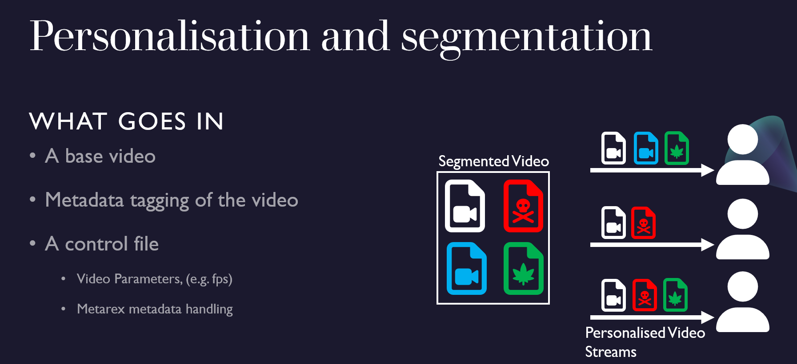
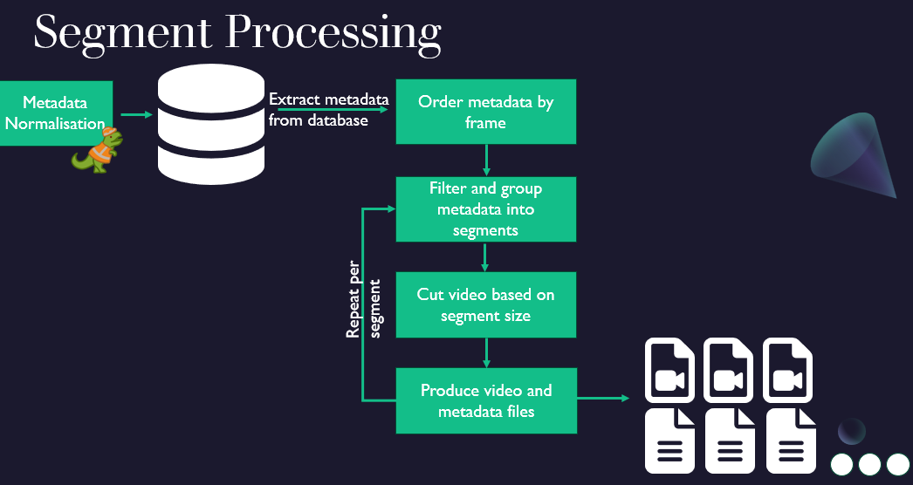
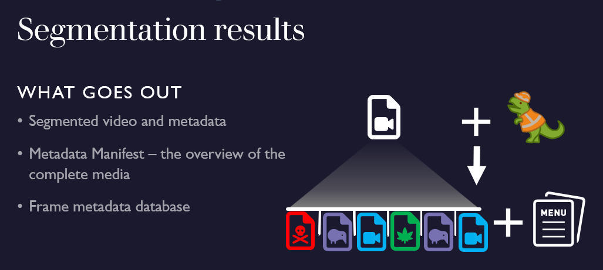

# mrx go sql

MRX GO SQL is an API endpoint demo for [metarex](https://metarex.media). This was used first used as
part of the [responsive narrative factory](https://show.ibc.org/accelerator-media-innovation-programme/accelerator-project-responsive-narrative-factory) IBC accelerator project.

This is the tool for splitting videos into segments based on their metadata tags.
The tool is designed to handle metadata tags from any source, as they all
roughly contain the same tags, just in different layouts and formats.

## Overview





## Scope

The Metarex sql program is designed to take generic metadata tagging of videos, from a variety of sources
, where it sanitises the metadata and use it for segmenting the video into and mp4 and webvtt files.

This tool is designed for sources to be mapped in a generic fashion, so that they can
be uniformly extracted into segments and handled by the a series of API calls.
Really extravagant data sources may not be able to be handled, such as ones that
have multiple nests of metadata.
This is due to the program being a work in progress and the sources
being used for the demo only having up to three layers of nesting.

## Usage

The segments and updates to the segments are all handled via API calls.
This has been done to demo the intended functionality of the
[metarex register](https://metarex.media/ui/reg/). Where metadata
can be extracted and handled via endpoints.

There are three seperate API Calls for generating video and these are.

1. Generating a new video metadata database
2. segmenting the video, using the database
3. Updating the metadata subtitles for the video segments

Optional API calls are:

1. list all database Ids

### database call

The first and most important call is to
generate a database, while making the
metadata a generic format.

The database generation call is split into mapping the
metadata with query paramters, and the POST body of metadata.

The list of available query parameters  to
be mapped are:

- groups - groups is the highest tag of the metadata tracks
- groupsTag - this is the tag linked to a group
- tracksTag - this is the tag linked to a track, that is one or more metadata events.
- tracks - the second highest level to contain metadata
- start - the frame start point (inclusive)
- end - the frame start point (inclusive)
- metadataTag - the tag for the metadata of a single event,
- dataType - the format the data is in, (json,yaml or csv)

The only required tags are dataType, start, end and metadataTag.
The groups and tracks fields are used if the metadata is nested.

This returns a json of the JobID, which is used with every other ID.
An example call is `http://0.0.0.0:1323/newdb?groups=chapter&start=in&end=oute&metadataTag=combined&dataType=csv`, this
call contains a csv body as part of the push request.

```json
{
  "Registered": 2723467568719070338
}
```

otherwise an error will be returned

### segment call

Post a json body with the following fields

- Size - the size of the segment in frames - may be redundant now as the size is set by the metadata
- Framerate - the framerate of the input and output video
- Title - the title of the video, this lines up with things declared in config
- OutputFolder - where the file would be saved locally on the server
- SegmentsToGen - the array of segments to generate, if left empty all are generated.

e.g.

```json
{
  "title": "Springwatch",
  "size": 4000,
  "framerate": 25,
  "OutputFolder": "sw",
  "SegmentsToGen" : []
}
```

each call  to segment one only runs once, overwrites should
be put in place as a query parameter this needs to be fixed.

example call would be `http://0.0.0.0:1323/{JobID}/segment`

### metadata webvtt update call

There are two update methods in place.

1. update all, takes a json object and applies it to everysingle segment. e.g. `{"studio":"blender"}`
2. update, takes a json object which is a map of segment numbers and their updates. `{"1":{"studio":"blender"}, "2":{"other":"data"}}`

After the updates are applied to the vtts, overwriting any conflicting fields, with
the newer value.
This then rezips all the updated segments and reuploads
them to the stored folder and updates the manifest for that folder.

### Api handling order

The first call that must be made is to set up the database for the frames. This returns a jobID if successful.
You then segment it, with a separate new call.
Then apply as many metadata updates to it as you would like,
be aware that the metadata can be overwritten and there is not an
option to currently delete metadata.

## Program Set Up

In order to segment the videos, you need to have them
saved and accessible by the server.

This means the videos need to be in frame by frame images and the audio,
as a wav or uncompressed audio.

An example ffmpeg commands for getting uncompressed audio froma video:

``` ffmpeg -i input.mp4 -acodec pcm_s24le -ac 1 -ar 48000 output.wav ```

An example ffmpeg command for extracting video frames:

``` ffmpeg -i  input.mp4  -qmin 1 -qmax 1 frame%05d.jpg ```

The [configuration file](#the-config-files) needs,
to be set up so the serer can access these files.

### The config files

To declare the locations of frames and audio you
need to set up the config.json in the config folder.
The purpose of this config is to abstract the video frames and audio away from the user input,
removing the onus of putting the full path down from the user.

Input frames needs to be able to be in a format that ffmpeg understands e.g. folder/frame%05d.jpg  

```json

{
  "title" : {
        "InputFrames": "C:/example/frame%05d.jpg",
        "InputAudio" : "C:/example/audio.wav"
  },
    "title2" : {
        "InputFrames": "C:/example2/frame%05d.jpg",
        "InputAudio" : "C:/example2/audio2.wav"
  }
}

```

It is up to you to source the video frames and audio you would like to segment

### dependencies

Ensure ffmpeg is installed, otherwise the segments will not be generated.

#### file types

Ensure audio files are uncompressed such as PCM wav files,
so that the audio will sync up with the video.
Any file type you choose must be able to be handled by
ffmpeg.

## Shorthand list of calls

This is a tool for IBC [responsive narrative factory](https://show.ibc.org/accelerator-media-innovation-programme/accelerator-project-responsive-narrative-factory).

Call the API using however you fancy examples are below
Post  <http://0.0.0.0:1323/newdb?groups=chapter&start=in&end=oute&metadataTag=combined> - returns a job id of 123456
POST  <http://0.0.0.0:1323/123456/segment> with some Json input
POST  <http://0.0.0.0:1323/123456/update> A Json of `map[int]map[string]any`

to use simply run `go build`
then you can run the server with `./sqlgo`.

## Program Output

The program segments up and zips the contents as a tarball, (tar.gz) file
This zip contains the following

- The video as an mp4, the naming format is title_segmentnumber_comma,separated,metadata,tags.mp4
- A webvtt containing a json of the metadata, this has the same naming format as the mp4.

### Manifest

In addition to the segments a manifest is produced, this contains:

- The source of the segmented video, e.g. "Big Buck Bunny"
- The framerate ,e.g. 24
- The list of all metadata tags e.g. `"All Metadata Tags": ["titles","intro"]`
- A map of the segment number and its associated metadata e.g.

```json
"Segments": {
    "0": {
        "In": 1,
        "Out": 29,
        "Md5": "1b9aeade7ebe80378b4016bde7f12a6b",
        "Tags": "main-intro"
    }
```

Each segment has a field giving the frame in and out. The metadata tags and the hash of the segment.
The hash's purpose that if only one segment has data that changes than you can compare manifest versions and see
which segments you would need to redownload.
